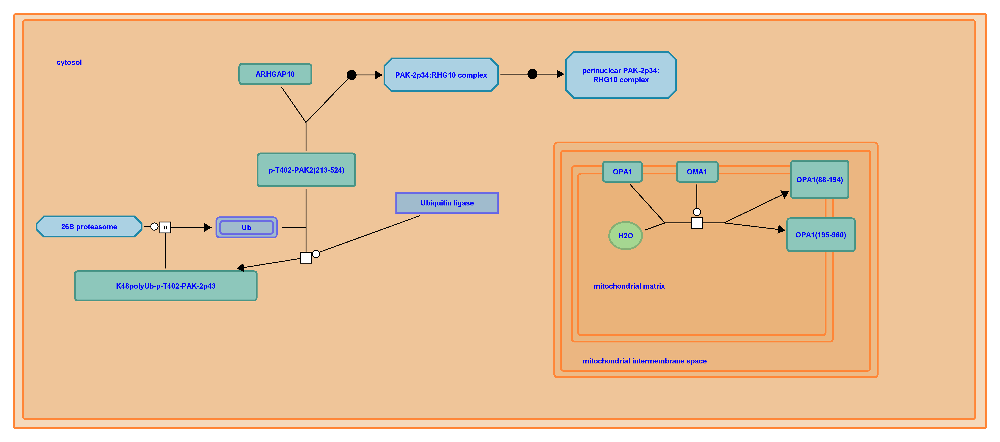

# Raster exporter
Exports a diagram in the Pathway Browser to an image.
Current supported formats are:
- png (with transparency)
- jpg, jpeg, gif (with white background)

The diagram is generated using the diagram JSON file, so you may notice 
small differences with Pathway Browser.

<div>

</div>


## Exporting a diagram

```
String stId = "R-HSA-169911";
String ext = "png"; // png, jpeg, jpg, gif
Double factor = 2;  // 0.1 to 10
Decorator decorator = new Decorator(selection, flags);
String token = "MjAxNzEwMTIxNTE2MjJfNjk%253D";
ColorSchem scheme = new ColorScheme("modern", "standard", "cyan");
// This path must contain "R-HSA-169911.json" and "R-HSA-169911.graph.json" files
String diagramPath = "path/to/diagram";

BufferedImage image = RasterExporter.export(stId,
    diagramPath, ext, factor, decorator, token, scheme);

// If saving to a file
ImageIO.write(image, ext, new File(path, filename));
// If sending through an URL
URL url = new URL("http://");
HttpUrlConnection connection = (HttpUrlConnection)
url.openConnection();
connection.setDoOutput(true);  // your url must support writing
OutputStream os = connection.getOutputStream();
ImageIO.write(image, ext, os);
```
